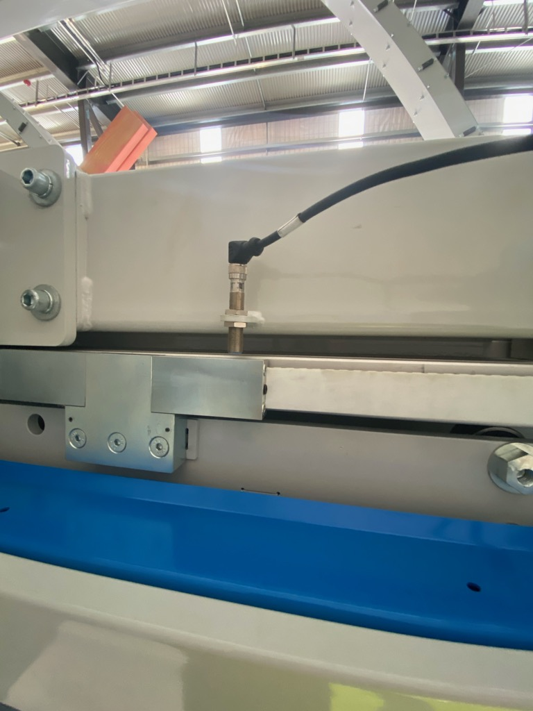
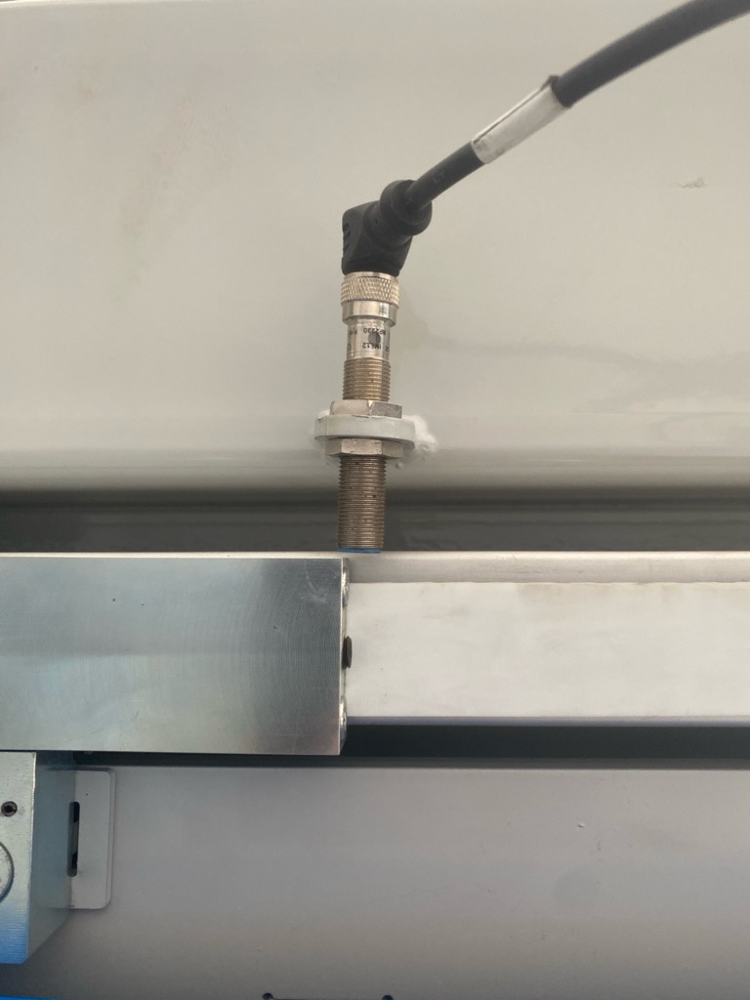

# M21856 - fixed side gripper out by 30 mm

**Mainland, Raked Wall Extruder V3, Omron build. 22 September 2026.** Solved.

## What the operator said

> fixe side out by 30mm

## What was wrong

The fixed side trolley's **home sensor was sitting too far from its aluminium block.**

Nothing had changed in `Change.log`, which is the tell. The trolleys home to a sensor
(`HomeMode = Sensor` in `RakingWallExtruderV3DG.xml`), and that sensor sets where the machine
thinks zero is. So when the sensor is wrong, every position the machine drives to afterwards is out
by the same amount - and no setting shows it, because no setting was touched.

## How home is found

1. The trolley drives onto its aluminium block until the sensor sees it.
2. It then drives **slowly off** the block.
3. **The exact moment the sensor turns off is home.**

That falling edge is the accurate spot. For it to be crisp, the sensor has to sit **1-2 mm from the
block**. Too far and the switching point drifts, so home lands in the wrong place.

| Before - sensor too far from the block | After - 1-2 mm |
|---|---|
|  |  |

## The fix

With the gripper clear of timber and safe to move, send the fixed gripper home and look at the
sensor. Reposition it 1-2 mm from the aluminium block. Re-home.

## Was it in the log? Yes

The two side pullers normally finish homing **in the same millisecond**. On M21856 they did not:

```
07:45:18  fixed 39.82 s, floating 37.65 s - the fixed side was 2.17 s late.
```

Against every other full homing run on file:

| Machine | Full homing runs | Fixed minus floating |
|---|---|---|
| M21737 | 1 | 0.00 s |
| M21844 | 1 | 0.00 s |
| M20771 (Feb 2025 - Aug 2026) | 4 | 0.00 s every time |
| **M21856** | 1 | **+2.17 s** |
| **M20771 (21 Sept 2026)** | 1 | **-1.40 s** (floating late) |

Short re-homes from nearly home wobble by up to 0.8 s and are ignored; only a full home travels far
enough to show it.

The app now checks this (`HomingBalanceCheck`) and reports it as **THE TWO PULLERS DID NOT HOME
TOGETHER**, naming the late side and the sensor to look at.

## Still open

- **A log from M21856 after the fix** would show the gap back to 0.00 s and confirm the check works
  both ways.
- **M20771 at Trusstech shows the same signature on the floating side** in its latest export -
  1.40 s late. Unconfirmed, but worth a look at that sensor on the next visit.
- The 2.17 s is not converted to millimetres. That needs the home velocity's units and the back-off
  distance; a wrong conversion would be worse than "this side was late".
